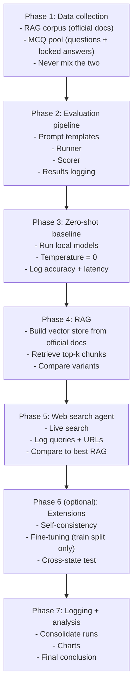
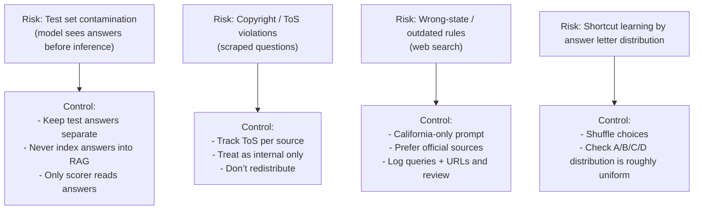

# CA P&C Broker License — LLM Benchmark Roadmap

This file is a **simple execution plan** for this repo, based on `CA_PnC_LLM_Benchmark_Roadmap.pdf`.

## The big idea (in one paragraph)

If a **local** language model that **never sees the test answer key** can repeatedly score **70%+** on a clean multiple‑choice CA Property & Casualty exam set, that is strong evidence the knowledge is learnable and verifiable.

## The full workflow (diagram)

## Phase 1 — Data collection

### Goal

Collect clean inputs for:
- **RAG corpus**: reference documents the model may read at inference time
- **Evaluation dataset**: MCQs used to measure accuracy (answers must be hidden until scoring)

### Outputs

- **RAG corpus folder** with provenance (URL + download date + version/date-effective)
- **Raw MCQ staging folder** with sources noted
- **Normalized MCQ JSON** (one canonical schema for all sources)
- **Locked train/dev/test split** with **test answers separated**

### What to do

- **Keep two buckets separate**
  - **RAG corpus**: official sources (CDI, PSI handbook, CA Insurance Code, Title 10 regs, NAIC docs, etc.)
  - **Eval questions**: practice questions from permitted sources (follow ToS; do not redistribute)
- **Normalize questions to one schema**
  - `id`, `question`, `choices` (A–D), `correct` (letter), `explanation` (if available), `topic`, `difficulty` (if known), `source`, `split`
- **Deduplicate before splitting**
  - Use fuzzy matching; treat very similar items as duplicates and keep the richer one
- **Lock splits**
  - Example target: **70% train / 10% dev / 20% test**
  - Immediately remove `correct` from the **test** public file
  - Store test answers separately (never passed into prompts or retrieval)

## Phase 2 — Build the evaluation pipeline

### Goal

Make scoring **automatic and repeatable** so every experiment is comparable.

### Outputs

- Prompt templates (zero-shot and optional chain-of-thought)
- Runner that calls local models (e.g. Ollama)
- Scorer that computes accuracy (overall + per-topic) and writes one row per run
- Logging approach: machine log (CSV) + human log (README section)

### Prompt rules (recommended)

- **Zero-shot**: model must output **only one letter**: `A`, `B`, `C`, or `D`
- **CoT variant**: allow reasoning, but **final line must be the letter**; scoring reads last line only
- **Temperature**: default to **0** for deterministic runs

### Results logging (recommended)

Log each run with at least:
- model, method, number of questions, number correct, accuracy %, pass/fail (≥70%), avg latency, timestamp, hardware, notes

## Phase 3 — Zero-shot baseline (raw model knowledge)

### Goal

Measure what models can do **without** retrieval or web search.

### Outputs

- One output file per model run (raw responses + latency)
- One scored row per run in your results log
- Notes on weak topics (to target RAG improvements later)

## Phase 4 — RAG (retrieval-augmented generation)

### Goal

Test how much **official documents + retrieval** improve MCQ accuracy.

### Outputs

- Vector store built from official docs
- Results for multiple RAG variants

### Suggested variants

- **B1 (CDI/official docs only)**: retrieve from official corpus only
- **B2 (full corpus)**: add training-split prep explanations (never test split)
- **B3 (full + CoT)**: B2 plus chain-of-thought prompting; log latency impact

### Retrieval build rules (from the PDF)

- Chunk ~512 tokens with ~64 token overlap (tune if retrieval is poor)
- Embed locally (example: `nomic-embed-text`)
- Smoke test retrieval on dev questions (manual check)

## Phase 5 — Web search agent approach

### Goal

Compare live web-search augmentation vs. curated RAG.

### Outputs

- For each question: searches performed + URLs visited (audit trail)
- Accuracy + latency comparison vs best RAG variant

### Safety rules

- Force **California jurisdiction** in prompts and query style
- Prefer **official CA sources** (CDI, CA legislature, etc.)
- Start with a **100-question stratified sample** before scaling

## Phase 6 (optional) — Extensions

### 6.1 Self-consistency / majority vote

- Run each question multiple times at higher temperature (e.g. 5 runs at \(T=0.7\))
- Take majority vote
- Use selectively (it multiplies cost/latency)

### 6.2 Supervised fine-tuning (train split only)

- Fine-tune a smaller model on **training** questions (optionally with explanations)
- Early stop using **dev** accuracy
- Final report uses **held-out test** only

### 6.3 Cross-state transfer test

- Evaluate best CA setup on other states’ questions (no extra tuning)
- Label each item “universal” vs “CA-specific” and measure overgeneralization

## Phase 7 — Logging, analysis, and wrap-up

### Goal

Turn runs into a credible conclusion with traceable evidence.

### Outputs

- Consolidated run log (CSV + README)
- Charts (e.g. grouped bar chart: zero-shot vs best RAG vs web search)
- Final conclusion: can a properly configured local LLM pass?

## Risks and controls (must-follow)

## Quick-start (day one checklist)

If you want to start immediately, do these in order:

1. Install **Ollama** and verify API is reachable (default: `localhost:11434`).
2. Pull a few starter models (small to mid-size) and do a quick sanity check on a dev question.
3. Download the **CDI P&C exam outline** and **PSI candidate handbook** and save into a corpus folder (with URLs + dates).
4. Collect a small set of questions (e.g. 50), normalize to the canonical schema, and create a **dev sample** + **test sample**.
5. Strip answers from the test public file and store the answer key separately.
6. Implement prompt + runner + scorer. Verify scoring on the dev sample.
7. Run **zero-shot** on one model against the test sample and record accuracy + latency.
8. Log the run immediately.
9. Repeat for the next two models.
10. Review per-topic accuracy and decide what Phase 4 retrieval should target first.

