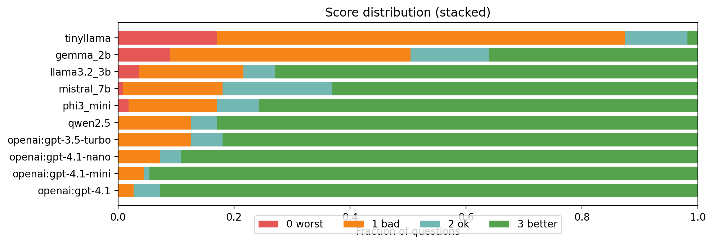
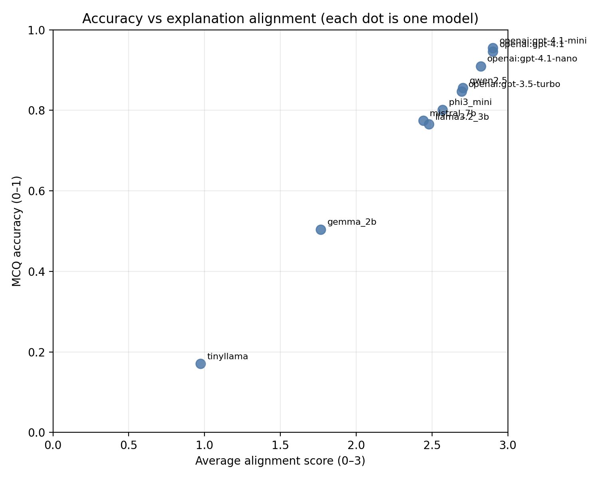

# Results plots (`Results_plots/`)

Exported **PNG figures** for write-ups (often copies of plots generated next to `judge_runs_openai/*/summary.csv`).

| File | Typical meaning |
|------|-----------------|
| `score_distribution_stacked.png` | Stacked or grouped view of judge **score** outcomes across models or buckets. |
| `accuracy_vs_alignment.png` | Scatter or line comparing **MCQ accuracy** vs **alignment** (reason quality). |
| `avg_alignment_score.png` | Bar or line of **mean alignment** per model or condition. |

**How we got them:** Run `scripts/plot_judge_summary.py` on a `summary.csv`, then copy the PNGs here for documentation.

These PNGs are embedded from [`eval_set/from_youtube_video/Results.md`](../eval_set/from_youtube_video/Results.md) (relative path `../../Results_plots/` from that file).

---

## Images in this folder

### `avg_alignment_score.png`

**What it shows:** Usually a **bar (or column) chart** of the judge’s **average alignment score** (0–3 scale) **per model** (or per run), summarizing how closely model-written reasons matched reference explanations.

### `score_distribution_stacked.png`

**What it shows:** A **stacked bar** view of how often the judge assigned each **score band** (0, 1, 2, 3) per model—useful to see whether a model gets mostly 3s or spreads mass into lower scores.

### `accuracy_vs_alignment.png`

**What it shows:** **MCQ correctness** (or accuracy) on the **x**-axis vs **average alignment** on the **y**-axis (one point per model). Highlights models that ace the letter answer but write weak reasons, or the opposite.

