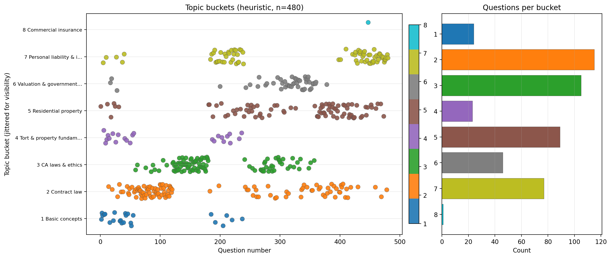

# Legacy Quizlet artifacts (`legacy/`)

Files moved here to keep `from_quizlet_pdfs/` limited to the **current** questions, answers, bucket table, and plot. Nothing in this folder is required to run the 800-Q benchmark. The parent `from_quizlet_pdfs/` directory lives under **`DATA/eval_set/`** (reachable as **`eval_set/from_quizlet_pdfs/`** from the repo root).

| File | Description |
|------|-------------|
| `README.txt` | Older human notes for the Quizlet PDF eval folder. |
| `answer_key_notice.txt` | Instructions / warnings about answer provenance. |
| `answers_inferred_scores.tsv` | Confidence-style scores when matching stems to Quizlet flashcard backs. |
| `answers_key_TEMPLATE.tsv` | Blank or example template for a human-checked key. |
| `sources.csv` | Traceability from items back to PDF / URL sources where recorded. |
| `*.bak_*` | Timestamped backups of `answers.txt`, `questions_formatted.txt`, and bucket CSV/PNG before large regenerations. |

---

## Images in this folder

### `question_buckets_heuristic.bak_20260501_132658.png`

**What it shows:** Same chart style as the current `question_buckets_heuristic.png` in the parent folder (scatter of question index vs bucket + bar counts), but from a **backup** taken before a later rebalance or regeneration.

**Why it is here:** Kept for comparison if bucket distributions or question counts changed between runs.

