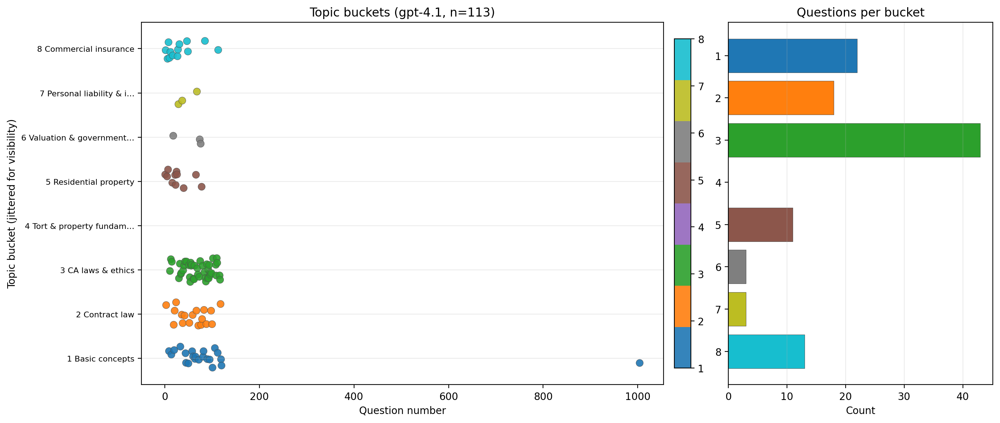

# YouTube / transcript eval (`from_youtube_video/`)

These files lived at the **root of `eval_set/`** before the repo was reorganized. They form a **smaller, separate** benchmark (**150** MCQ IDs in the current `questions.txt` / `answers.txt`) built from **California P&C broker-style content aligned to video / transcript study material**, not the Quizlet PDF dump pipeline. Older write-ups may still mention a **~113**-ID subset from an earlier dedupe pass.

**On disk:** this folder is **`DATA/eval_set/from_youtube_video/`**; the root **`eval_set/`** symlink points at `DATA/eval_set/`.

**Packaged copy:** the same three files are mirrored under **`results/from_youtube_video/`** — see [`results/README.md`](../../../results/README.md).

---

## `questions.txt`

**What it is:** Block-format MCQs (`N.` stem, `A.`–`D.`). Question IDs include a four-digit style (e.g. `1004`) in the historical export.

**How we got it:** Authored or extracted from the YouTube / course transcript workflow (see project root `README.md` history). This is the default `--questions` path for several **judge** and **results** scripts that predate the 800-Q Quizlet set.

---

## `answers.txt`

**What it is:** Ground-truth letters (`N A` lines) aligned to `questions.txt` in this folder.

**How we got it:** Curated / inferred during the same workflow as the questions. Used only for **scoring** after a model run, not as model input.

---

## `explanations.txt`

**What it is:** Reference **short explanations** aligned to the YouTube-track questions (used by judge scripts to score how well a model’s stated reason matches the reference).

**How we got it:** Human- or LLM-authored explanations in the transcript benchmark pipeline. After **`questions.txt` / `answers.txt` dedupe**, this file was **stripped and renumbered** so each line starts with the **new** question index (currently **`1…150`**; may begin with `#` comment lines; backups `explanations.txt.bak_*`).

---

## `question_buckets_gpt-4.1.csv`

**What it is:** OpenAI **GPT-4.1** assigned each question to **one of eight** curriculum buckets (`question_number`, `bucket`, `bucket_name`, `model`, `notes`). This is a **model judgment**, not the keyword heuristic used on the Quizlet side.

**How we got it:** Generated with `scripts/bucket_questions_openai.py` pointing at this folder’s `questions.txt`.

---

## `question_buckets_gpt-4.1.png`

**What it is:** **Scatter + bar chart** visualization of the GPT-4.1 bucket assignments (same layout idea as the heuristic plot on the Quizlet track).

**How we got it:** Written by `scripts/bucket_questions_openai.py` together with the CSV above.

---

## `Results.md`

**What it is:** Human-readable **benchmark results** for this track: MCQ accuracy table (~113 items), judge alignment table, embedded charts (paths point to repo-root `Results_plots/`), and pointers to raw CSV/JSONL artifacts.

**How we got it:** Curated from `results/*_reasoned.csv` and `judge_runs_openai/gpt-4.1/summary.csv`; charts refreshed via `scripts/plot_judge_summary.py`. This file was moved here from the repo root so all YouTube-track reporting lives beside the eval files it describes.
