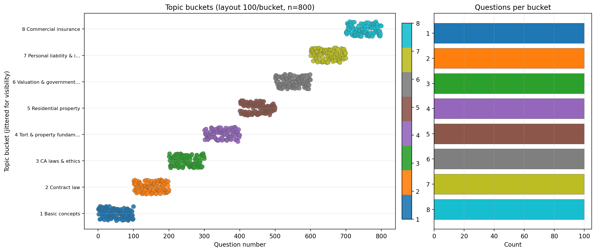

# Quizlet PDF eval (`from_quizlet_pdfs/`)

MCQs that started from **Quizlet-exported insurance PDFs**, converted with local parsers (`scripts/quizlet_pdfs_to_eval_txt.py`), then improved with **OpenAI** (formatting, synthetic fill, bucket balancing) and the **Insurance Information Institute handbook** PDF as reference text.

---

## `questions.txt`

**What it is:** Raw block-format questions (`N.` stem, `A.`–`D.` options, blank line between items) straight from the PDF → text pipeline (plus any manual fixes). This is the **original** Quizlet-derived corpus before heavy formatting.

**How we got it:** Run `scripts/quizlet_pdfs_to_eval_txt.py` with `--out-dir` pointing here (default), or maintain the file by editing exports from the Quizlet PDFs under `data/`.

---

## `questions_formatted_165.txt`

**What it is:** A **frozen snapshot (~165 questions)** after OpenAI was used to **reword / de-OCR** `questions.txt` (same numbering and A–D slots, cleaner prose). This is the intermediate set **before** the 800-question bucket balance.

**How we got it:** Produced with `scripts/format_questions_openai.py` (`--in questions.txt`, OpenAI model such as `gpt-4.1-mini`), then archived under this name so it is not overwritten by later `questions_formatted.txt` runs.

---

## `questions_formatted.txt`

**What it is:** The **canonical large eval**: **800** multiple-choice items, **100 per bucket** × 8 curriculum buckets (Basic concepts … Commercial insurance). Order is **bucket blocks** (questions 1–100 = bucket 1, 101–200 = bucket 2, …).

**How we got it:** Started from the formatted/heuristic-bucketed set; **trimmed** overfull buckets and **generated** fill-in items with `scripts/balance_eval_buckets_layout.py` (and/or `scripts/generate_synthetic_handbook_mcqs.py`) using **GPT-4.1** + handbook excerpts. Layout bucket labels are authoritative for this file (see CSV below).

---

## `answers.txt`

**What it is:** Ground-truth option letters for **`questions_formatted.txt`** only: one line per question after an optional `#` comment header (`N A` / `N B` / …).

**How we got it:** Mix of inferred keys from Quizlet flashcards, OpenAI-generated keys for synthetic items, and layout script output. **Do not** feed this file into model prompts for the same benchmark you score.

---

## `question_buckets_heuristic.csv`

**What it is:** One row per question (800 rows + header): `question_number`, `bucket` (1–8), `bucket_name`, `model`, `notes`. For this layout, `model` is **`layout_balanced`**: the bucket column reflects **position in the 800-Q layout** (each block of 100 shares one bucket), not a fresh keyword pass on the stems.

**How we got it:** Written by `scripts/balance_eval_buckets_layout.py` when building the 800-Q set. You can regenerate the **plot** from this CSV with `scripts/bucket_questions_openai.py --plot-only …`.

---

## `question_buckets_heuristic.png`

**What it is:** A **figure** with two panels: (left) scatter of question index vs bucket (with jitter), colored by bucket; (right) horizontal **bar chart of counts per bucket** (flat at 100 when the layout script last ran).

**How we got it:** Matplotlib output from the same tooling that reads `question_buckets_heuristic.csv` (see `scripts/bucket_questions_openai.py` → `write_plot`).

---

## `legacy/`

Older backups, inferred-score tables, templates, and the previous plain-text `README.txt`. See [`legacy/README.md`](legacy/README.md).

---

## Optional files (regenerated by tools)

If you run `scripts/quizlet_pdfs_to_eval_txt.py` with the default `--out-dir`, it may also create **`sources.csv`**, **`answer_key_notice.txt`**, and **`answers_key_TEMPLATE.tsv`** when the PDF lacks explicit keys. Move extras into `legacy/` when you are done editing so this folder stays easy to scan—or leave them and extend this README with a short note per file.
