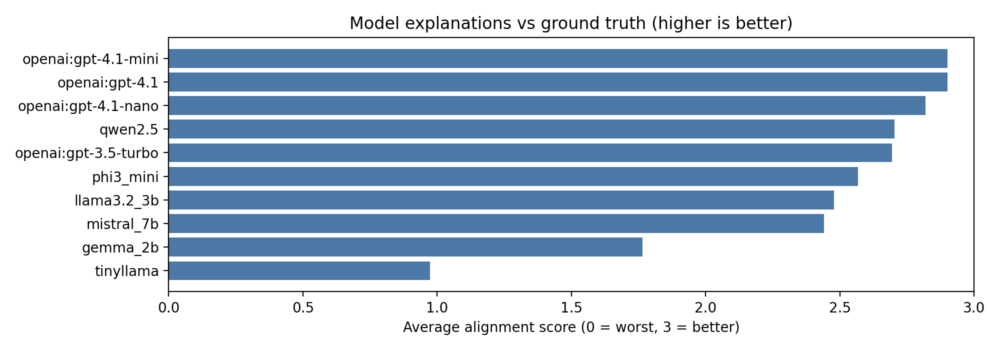

# Judge run: `gpt-4.1-mini`

This directory holds artifacts from scoring model outputs with an OpenAI **gpt-4.1-mini** judge (see repo `judge_runs_openai/README.md`).

Typical files: `summary.csv`, per-run `.jsonl` logs, and the **plot PNGs** below (generated or copied from `scripts/plot_judge_summary.py`).

---

## Images in this folder

### `avg_alignment_score.png`

**What it shows:** **Average judge alignment score** (0–3) per evaluated model run—how well each model’s stated **reason** matched the reference explanation in `eval_set/from_youtube_video/explanations.txt`.

### `score_distribution_stacked.png`

**What it shows:** **Stacked bars** of judge outcome counts (scores 0 through 3) per model, so you can see the full shape of quality (not just the mean).

### `accuracy_vs_alignment.png`

**What it shows:** Each **point is one model**: horizontal axis ≈ **MCQ accuracy** on the judged subset, vertical axis ≈ **mean alignment**. Separates “gets the letter right” from “explains like the reference.”

