# Benchmarking Large Language Models on Insurance Licensing–Style Multiple-Choice Exams: Methods, Results, and Implications for Exam Prep Tools

**Research evaluation report** · Artifacts under `results/` · May 2026

---

### How to view figures in this file

This document lives in **`results/report.md`**. Image paths are **relative to the `results/` folder** (for example `./charts/…`, `./from_youtube_video/…`). In **VS Code / Cursor**, open the Markdown preview **from a workspace whose root contains the `results/` directory** (the “Broker Test” project root), and allow **local** images in preview settings if prompted.

If figures still appear as broken icons, open the PNG paths directly in the tree: `results/charts/`, `results/from_youtube_video/judge_plots/`, and each `results/*/option/analysis/`.

---

## Abstract

Many learners adopt large language models (LLMs) to prepare for **California property-and-casualty–style** licensing exams: drill questions, explanations, and quick feedback. The *practical* goal is often framed as **passing**—hitting a cut score on a high-stakes test. This report documents a reproducible **case-study evaluation** of twelve model configurations (OpenAI API models plus open weights via Ollama) on **three** complementary MCQ corpora (Quizlet/PDF-derived, YouTube-oriented, synthetic handbook-style), with **letter accuracy** against held-out keys, **LLM-as-judge** alignment of rationales to reference explanations (YouTube subset), and **eight-way curriculum bucket** ablations. Frontier models reach **~75%** on the hardest scraped-style pool and **~99%** on the synthetic set; mid-sized open models (**≈7–9B**) approach or exceed **~80–95%** on the friendlier splits. **Implication:** if the only success criterion were coarse MCQ performance on practice-style material above **~3B parameters**, many modern models would already clear a low “passing” bar—so **research and product work** should shift toward **validity**, **calibration**, **topic-level weaknesses**, and **non-MCQ** competencies rather than headline accuracy alone.

**Keywords:** insurance licensing, LLM evaluation, multiple-choice QA, curriculum buckets, LLM-as-judge, explanation alignment, domain shift, Ollama, OpenAI API

---

## 1. Introduction

State licensing pathways for property and casualty insurance emphasize breadth (coverage lines, exclusions, state-specific rules) and precise reading of dense prose. Generative models are increasingly embedded in **study products**—question banks, chat tutors, and explanation generators.

**Motivation.** A natural user goal is to **pass the exam**: maximize expected score subject to time and effort. From a **research** standpoint, however, “passing” is an underspecified target: it depends on the **item bank**, **cut score**, **item difficulty**, and **correlation** between practice sets and the operational exam. This work therefore asks:

1. How do **frontier vs. open** models compare on **three** deliberately different corpora?
2. Do **rationales** track reference explanations when a key exists (YouTube)?
3. Where do models **fail within a fixed curriculum taxonomy** (eight buckets)?

**Contribution.** We release a compact, script-driven pipeline: MCQ runs in `option/*.csv`, automated accuracy tables, cross-corpus figures, an OpenAI judge over `explanations.txt`, and per-bucket accuracy heatmaps under each `option/analysis/`. Together, these support **interpretable** comparisons beyond a single leaderboard number.

---

## 2. Materials and methods

### 2.1 Benchmark corpora

| Corpus | Folder | Role | Answer-key scope |
|--------|--------|------|-------------------|
| **Quizlet / PDF-derived** | `from_quizlet_pdfs/` | Large, heterogeneous pool; **hardest** for top models | **550** overlapping A–D scored items (from `answers.txt`) |
| **YouTube-oriented** | `from_youtube_video/` | Transcript/video-aligned validation split | **150** items |
| **Synthetic handbook-style** | `synthetic_data/` | Controlled 50×8 bucket layout | **400** items |

### 2.2 Models

**OpenAI API:** GPT-4o, GPT-4o mini, GPT-4.1 mini, GPT-4.1 nano, GPT-3.5 Turbo (identifiers embedded in CSV filenames). **Local (Ollama):** TinyLlama 1.1B, Gemma 2 2B / 9B, Phi-3 Mini 3.8B, Qwen2.5 7B, Mistral 7B, Llama 3.1 8B. Parameter labels for API “mini/nano” classes follow common **informal** public estimates where noted.

### 2.3 Task

Four-way MCQ (A–D); models emit a letter and a short `reason` string where the pipeline requests it.

### 2.4 Letter accuracy

Let \(G\) be question ids with gold letter in \(\{A,B,C,D\}\), and \(P\) ids with a valid model letter. Accuracy is computed on **\(G \cap P\)**: \(\#\{\text{correct}\}/|G \cap P|\). Implementation matches `scripts/update_option_results_tables.py`.

### 2.5 Explanation judge (YouTube)

Reference lines in `from_youtube_video/explanations.txt` are compared to each model’s `reason` by a fixed **gpt-4.1-mini** judge (`scripts/judge_reasoning_openai.py`), producing **alignment_score** ∈ {0,1,2,3} per item (**148** judged overlaps in the run summarized here). See Table D.

### 2.6 Curriculum buckets (eight topics)

Items are mapped to buckets **1–8** (Basic concepts … Commercial insurance). **Quizlet** and **YouTube** use `question_buckets_gpt-4.1.csv`. **Synthetic** uses the generator layout **50 consecutive ids per bucket** (same names), consistent with `answers.txt` header. Per-bucket accuracy uses ids in the overlap of gold, prediction, and bucket map (`scripts/analyze_option_buckets.py` → each `option/analysis/`).

### 2.7 Figures and reproduction

| Output | Script |
|--------|--------|
| Cross-corpus MCQ bar/heatmap | `scripts/plot_option_accuracy_across_sources.py` |
| Judge plots | `scripts/plot_judge_summary.py`, `scripts/run_youtube_openai_judge_and_plots.sh` |
| Bucket heatmaps / means / per-model bars | `scripts/analyze_option_buckets.py` |

---

## 3. Results

### 3.1 Overall MCQ accuracy across corpora

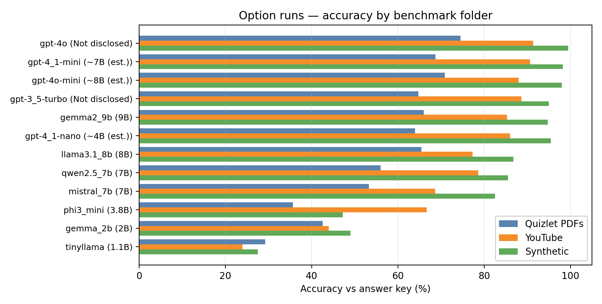

**Takeaway.** The same model family can look “exam-ready” on **synthetic** items yet **much weaker** on **Quizlet PDF–style** noise; any single-corpus number is a **partial** view of capability.

**Takeaway.** Open-weight **scale** orders models roughly as expected on the left (Quizlet) axis, but **separations compress** on synthetic data—where the evaluation is less discriminative for strong models.

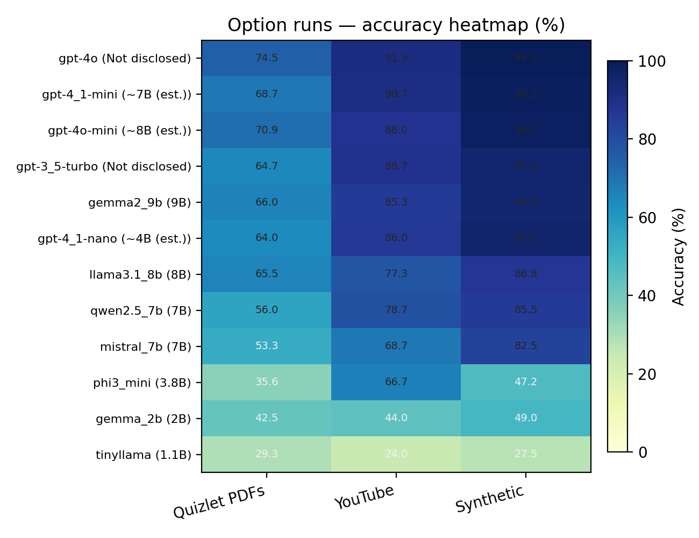

**Takeaway.** The heatmap makes **domain shift** visible as horizontal “stripes” of warm vs. cool cells for the same row (model).

**Takeaway.** Numeric cells support **pairwise** reading (e.g., same model Quizlet vs. YouTube) without re-parsing tables.

### 3.2 Mean MCQ accuracy across corpora (unweighted)

| Model | Params (reporting) | Quizlet | YouTube | Synthetic | Mean |
|-------|-------------------:|--------:|--------:|----------:|-----:|
| GPT-4o | Not disclosed | 74.55% | 91.33% | 99.50% | **88.46%** |
| GPT-4.1 mini | ~7B (est.) | 68.73% | 90.67% | 98.25% | **85.88%** |
| GPT-4o mini | ~8B (est.) | 70.91% | 88.00% | 98.00% | **85.64%** |
| GPT-3.5 Turbo | Not disclosed | 64.73% | 88.67% | 95.00% | **82.80%** |
| Gemma 2 9B | 9B | 66.00% | 85.33% | 94.75% | **82.03%** |
| GPT-4.1 nano | ~4B (est.) | 64.00% | 86.00% | 95.50% | **81.83%** |
| Llama 3.1 8B | 8B | 65.45% | 77.33% | 86.75% | **76.51%** |
| Qwen2.5 7B | 7B | 56.00% | 78.67% | 85.50% | **73.39%** |
| Mistral 7B | 7B | 53.27% | 68.67% | 82.50% | **68.15%** |
| Phi-3 Mini | 3.8B | 35.64% | 66.67% | 47.25% | **49.85%** |
| Gemma 2 2B | 2B | 42.55% | 44.00% | 49.00% | **45.18%** |
| TinyLlama | 1.1B | 29.27% | 24.00% | 27.50% | **26.92%** |

### 3.3 Per-corpus MCQ tables

#### Table A — `from_quizlet_pdfs` (550 overlaps)

| CSV | Parameters | Correct | Wrong | Accuracy |
|-----|------------|--------:|------:|----------:|
| `gpt-4o_reasoned_from_quizlet_pdfs.csv` | Not disclosed | 410 | 140 | **74.55%** |
| `gpt-4o-mini_reasoned_from_quizlet_pdfs.csv` | ~8B (est.) | 390 | 160 | **70.91%** |
| `gpt-4_1-mini_reasoned_from_quizlet_pdfs.csv` | ~7B (est.) | 378 | 172 | **68.73%** |
| `gemma2_9b_reasoned.csv` | 9B | 363 | 187 | **66.00%** |
| `llama3.1_8b_reasoned.csv` | 8B | 360 | 190 | **65.45%** |
| `gpt-3_5-turbo_reasoned_from_quizlet_pdfs.csv` | Not disclosed | 356 | 194 | **64.73%** |
| `gpt-4_1-nano_reasoned_from_quizlet_pdfs.csv` | ~4B (est.) | 352 | 198 | **64.00%** |
| `qwen2.5_7b_reasoned.csv` | 7B | 308 | 242 | **56.00%** |
| `mistral_7b_reasoned.csv` | 7B | 293 | 257 | **53.27%** |
| `gemma_2b_reasoned.csv` | 2B | 234 | 316 | **42.55%** |
| `phi3_mini_reasoned.csv` | 3.8B | 196 | 354 | **35.64%** |
| `tinyllama_reasoned.csv` | 1.1B | 161 | 389 | **29.27%** |

#### Table B — `from_youtube_video` (150 items)

| CSV | Parameters | Correct | Wrong | Accuracy |
|-----|------------|--------:|------:|----------:|
| `gpt-4o_reasoned_from_youtube_video.csv` | Not disclosed | 137 | 13 | **91.33%** |
| `gpt-4_1-mini_reasoned_from_youtube_video.csv` | ~7B (est.) | 136 | 14 | **90.67%** |
| `gpt-3_5-turbo_reasoned_from_youtube_video.csv` | Not disclosed | 133 | 17 | **88.67%** |
| `gpt-4o-mini_reasoned_from_youtube_video.csv` | ~8B (est.) | 132 | 18 | **88.00%** |
| `gpt-4_1-nano_reasoned_from_youtube_video.csv` | ~4B (est.) | 129 | 21 | **86.00%** |
| `gemma2_9b_reasoned.csv` | 9B | 128 | 22 | **85.33%** |
| `qwen2.5_7b_reasoned.csv` | 7B | 118 | 32 | **78.67%** |
| `llama3.1_8b_reasoned.csv` | 8B | 116 | 34 | **77.33%** |
| `mistral_7b_reasoned.csv` | 7B | 103 | 47 | **68.67%** |
| `phi3_mini_reasoned.csv` | 3.8B | 100 | 50 | **66.67%** |
| `gemma_2b_reasoned.csv` | 2B | 66 | 84 | **44.00%** |
| `tinyllama_reasoned.csv` | 1.1B | 36 | 114 | **24.00%** |

#### Table C — `synthetic_data` (400 items)

| CSV | Parameters | Correct | Wrong | Accuracy |
|-----|------------|--------:|------:|----------:|
| `gpt-4o_reasoned_synthetic_data.csv` | Not disclosed | 398 | 2 | **99.50%** |
| `gpt-4_1-mini_reasoned_synthetic_data.csv` | ~7B (est.) | 393 | 7 | **98.25%** |
| `gpt-4o-mini_reasoned_synthetic_data.csv` | ~8B (est.) | 392 | 8 | **98.00%** |
| `gpt-4_1-nano_reasoned_synthetic_data.csv` | ~4B (est.) | 382 | 18 | **95.50%** |
| `gpt-3_5-turbo_reasoned_synthetic_data.csv` | Not disclosed | 380 | 20 | **95.00%** |
| `gemma2_9b_reasoned.csv` | 9B | 379 | 21 | **94.75%** |
| `llama3.1_8b_reasoned.csv` | 8B | 347 | 53 | **86.75%** |
| `qwen2.5_7b_reasoned.csv` | 7B | 342 | 58 | **85.50%** |
| `mistral_7b_reasoned.csv` | 7B | 330 | 70 | **82.50%** |
| `gemma_2b_reasoned.csv` | 2B | 196 | 204 | **49.00%** |
| `phi3_mini_reasoned.csv` | 3.8B | 189 | 211 | **47.25%** |
| `tinyllama_reasoned.csv` | 1.1B | 110 | 290 | **27.50%** |

### 3.4 YouTube — rationale alignment (judge **gpt-4.1-mini**)

#### Table D — Judge summary (`judge_runs_openai/gpt-4.1-mini/summary.csv`)

| Run | n | MCQ acc. | Avg align | %0 | %1 | %2 | %3 |
|-----|--:|---------:|----------:|---:|---:|---:|---:|
| `gpt-4o_reasoned_from_youtube_video` | 148 | 91.22% | 2.87 | 1.35% | 3.38% | 2.03% | 93.24% |
| `gpt-4_1-mini_reasoned_from_youtube_video` | 148 | 90.54% | 2.86 | 0.68% | 4.05% | 4.05% | 91.22% |
| `gpt-4o-mini_reasoned_from_youtube_video` | 148 | 87.84% | 2.78 | 0.68% | 8.11% | 3.38% | 87.84% |
| `gpt-4_1-nano_reasoned_from_youtube_video` | 148 | 85.81% | 2.73 | 0.68% | 10.81% | 3.38% | 85.14% |
| `gpt-3_5-turbo_reasoned_from_youtube_video` | 148 | 88.51% | 2.70 | 2.70% | 9.46% | 2.70% | 85.14% |
| `gemma2_9b_reasoned` | 148 | 85.14% | 2.70 | 1.35% | 10.81% | 4.73% | 83.11% |
| `qwen2.5_7b_reasoned` | 148 | 78.38% | 2.55 | 2.03% | 14.86% | 8.78% | 74.32% |
| `llama3.1_8b_reasoned` | 148 | 77.03% | 2.50 | 2.03% | 20.27% | 3.38% | 74.32% |
| `mistral_7b_reasoned` | 148 | 68.24% | 2.46 | 2.03% | 18.24% | 11.49% | 68.24% |
| `phi3_mini_reasoned` | 148 | 66.89% | 2.26 | 2.70% | 24.32% | 16.89% | 56.08% |
| `gemma_2b_reasoned` | 148 | 43.92% | 1.64 | 14.86% | 36.49% | 18.92% | 29.73% |
| `tinyllama_reasoned` | 148 | 24.32% | 0.78 | 37.84% | 50.00% | 8.11% | 4.05% |

Per-item JSONL: `judge_runs_openai/gpt-4.1-mini/*.jsonl`.

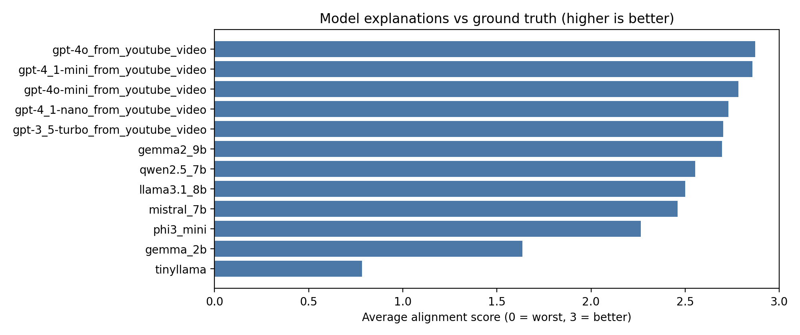

**Takeaway.** Mean alignment **ranks** models similarly to MCQ accuracy but is not identical: it rewards **reference-shaped** reasoning, not only the correct letter.

**Takeaway.** The long left tail for the smallest model shows that **wrong answers** and **poor explanations** tend to co-occur in this setup.

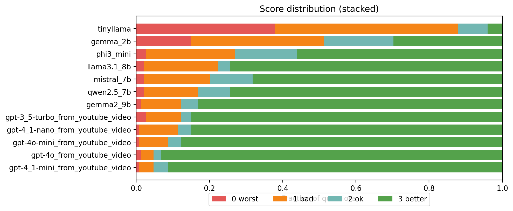

**Takeaway.** Stacked bars expose **mass at score 3** for top models versus **mass at 0–1** for weak baselines—useful for communicating risk to learners.

**Takeaway.** Mid-tier models often show a **thick “2” band** (mostly right idea, imperfect wording), which is exactly where human review can add value.

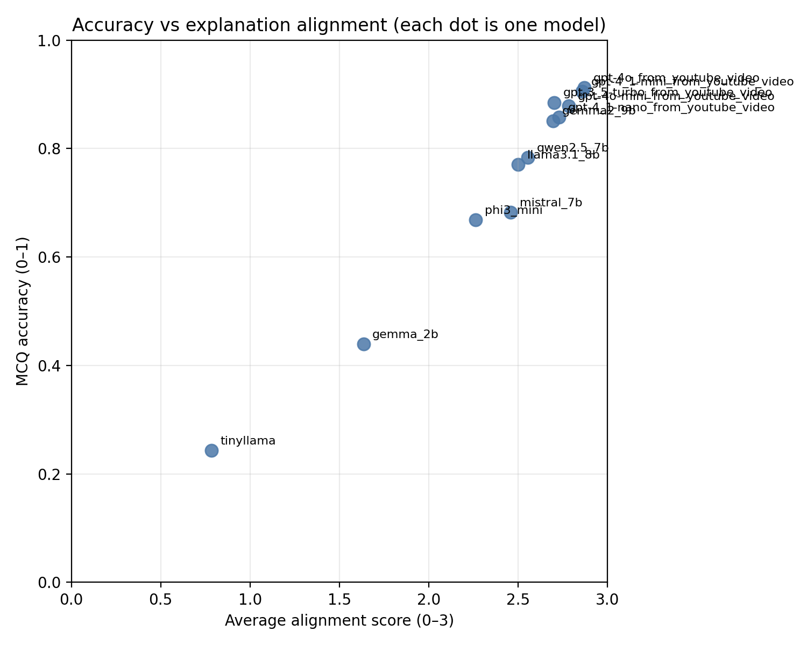

**Takeaway.** Positive correlation supports using **cheap MCQ probes** as a first screen, with **judge or human** checks when explanations will be shown to users.

**Takeaway.** Deviations from the diagonal motivate **error analysis**: some models may be “lucky” on letters or “verbose but aligned.”

### 3.5 Curriculum bucket ablations (MCQ accuracy within topic)

For each corpus, **Figure pair (heatmap, mean-by-bucket)** summarizes where models cluster in performance across the eight curriculum buckets. Rows in heatmaps are sorted by **overall mean accuracy** (across buckets, ignoring NaNs). Additional **per-model bar charts** exist as `option/analysis/<model>_by_bucket.png` (not all duplicated here to keep the report readable).

#### Quizlet / PDF-derived (`from_quizlet_pdfs/option/analysis/`)

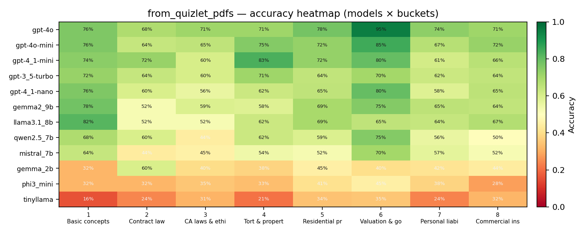

**Takeaway.** Vertical “cold” columns identify **topic buckets** that systematically hurt many models—good targets for harder drill sets or instructor review.

**Takeaway.** Spread across rows shows that **parameter scale** still matters on messy real-world study material.

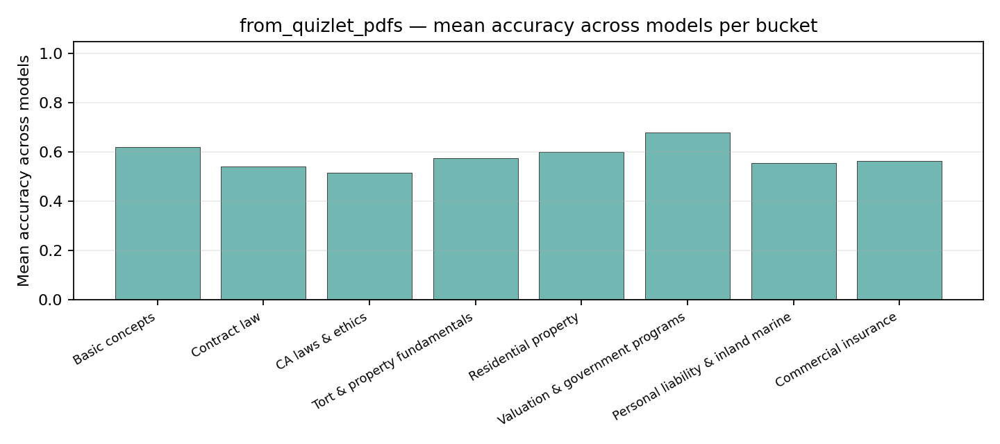

**Takeaway.** Buckets with low means are **hard for the field**, not only for one vendor model.

**Takeaway.** If product goals include “balanced mastery,” these means suggest **where** to rebalance generated practice.

#### YouTube (`from_youtube_video/option/analysis/`)

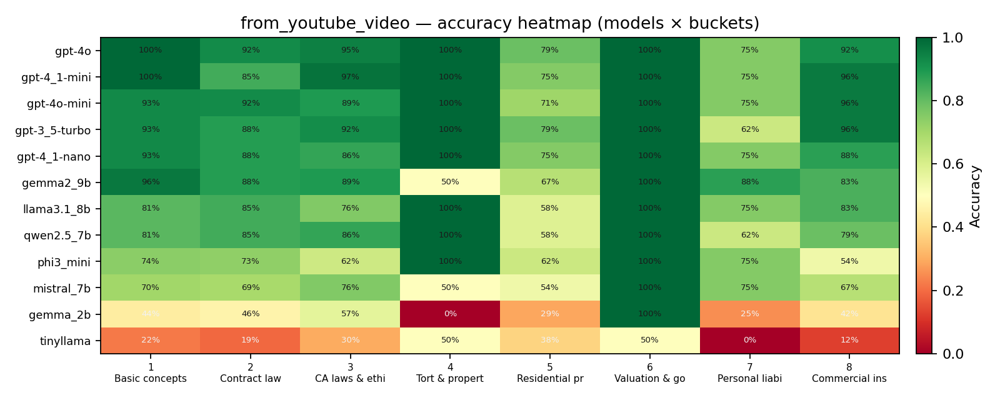

**Takeaway.** With \(N=150\), some bucket cells are **sparse**; interpret low-accuracy cells with the companion `bucket_accuracy_long.csv` counts.

**Takeaway.** The pattern still shows whether certain topics (e.g., commercial lines) concentrate errors for **multiple** systems.

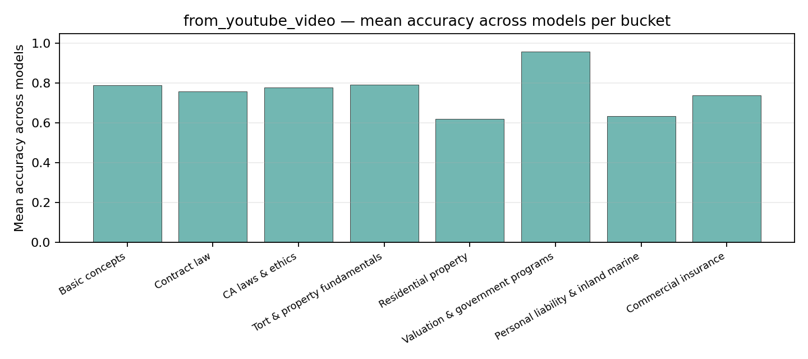

**Takeaway.** Mean-by-bucket on YouTube complements the **judge** analysis: a model can score well on letters in a bucket while still needing explanation polish (see §3.4).

#### Synthetic (`synthetic_data/option/analysis/`)

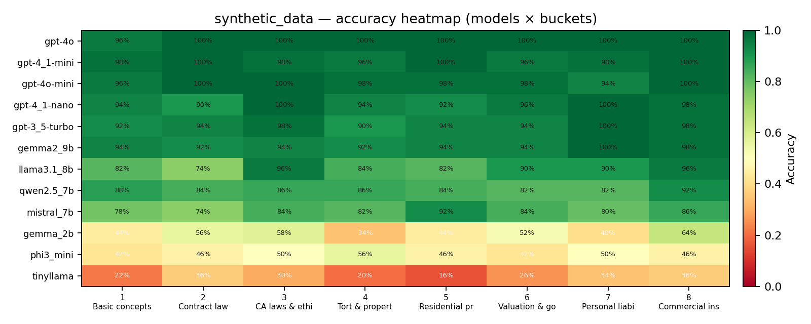

**Takeaway.** Synthetic heatmaps are **visually greener** overall—consistent with high ceiling accuracy and controlled generation.

**Takeaway.** Residual red pockets still reveal **which curriculum slice** remains hard for sub-8B models.

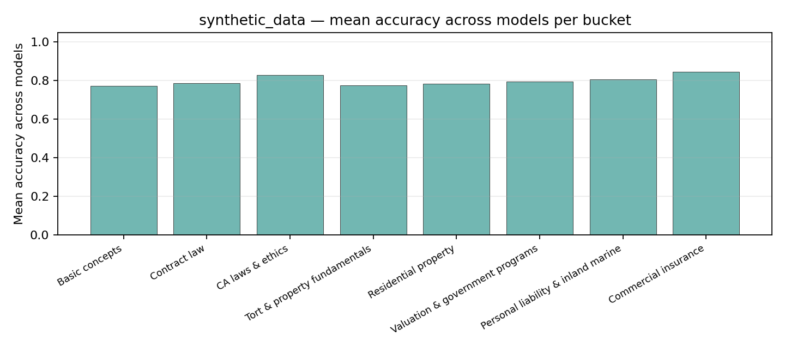

**Takeaway.** When even **mean** bucket accuracy is high, the evaluation is less about “who passes” and more about **ranking** among strong systems.

**Takeaway.** Use synthetic results for **regression testing** after prompt or pipeline changes, not as sole evidence of exam readiness.

---

## 4. Discussion

**Exam “passing” vs. research quality.** On the **synthetic** and, to a lesser extent, **YouTube** splits, several models at **roughly 4B parameters and above** already achieve **high** MCQ accuracy. If the only barrier imagined were “enough practice items with answer keys,” then **scaling past ~3B** appears sufficient for *that* barrier on these corpora. **Operational licensing exams**, however, impose **procedural**, **reading-comprehension**, and **adversarial** demands that MCQ benchmarks here do not capture. The more defensible research conclusion is: **practice-style MCQ accuracy saturates quickly**; the remaining work is **validity** (does the item bank predict outcomes?), **fairness**, **calibration**, and **safe deployment** of explanations.

**Domain shift** remains the dominant story: rankings are **partially stable** across corpora, but **absolute** performance moves by tens of percentage points. Product teams should therefore **never** quote a single-number “pass probability” from one bank.

**Buckets** operationalize a **curriculum view**: they show *where* to invest content—not only *whether* a model is “good.”

**Judge limitations.** The gpt-4.1-mini judge is useful for **relative** comparison and QA sampling, not as a ground truth of pedagogical quality—especially when judging **near-identical** API model families.

---

## 5. Limitations

- Not an **official** examination; non-certifying.
- **Keys and explanations** may contain extraction noise.
- **API / weight snapshots** drift; archive exact versions with each run.
- **Overlap metric** excludes invalid model letters (can inflate vs. strict user-facing scoring).
- **LLM judge** subjectivity and **bucket labels** (GPT-4.1–based for two corpora; layout-based for synthetic) introduce **measurement dependence**.

---

## 6. Conclusion

We presented a **multi-corpus**, **multi-metric** evaluation of LLMs on insurance licensing–style MCQs: **letter accuracy**, **reference-aligned explanations** (YouTube), and **topic-bucket** error structure (all corpora). The evidence supports a **pragmatic** conclusion for learners: larger models and frontier APIs are strong **practice assistants** on clean or synthetic material, but **messy** study PDFs remain challenging—so “exam prep” products should surface **uncertainty**, **citations to primary law and manuals**, and **human oversight**, especially below ~7B or on adversarial items. For **research**, the closing recommendation is to treat **“passing” on practice MCQs**—especially with models above a few billion parameters—as a **low** bar; the scientific and engineering problem is to characterize **when** model advice is **reliable enough** to stake regulatory and financial outcomes on it.

---

## 7. Data and code availability

| Artifact | Location |
|----------|----------|
| Questions, keys, explanations | `results/from_quizlet_pdfs/`, `results/from_youtube_video/`, `results/synthetic_data/` |
| Model CSVs | each `results/*/option/*.csv` |
| MCQ accuracy tables | `results/*/results.md` · `scripts/update_option_results_tables.py` |
| Cross-corpus MCQ figures | `results/charts/*.png` · `scripts/plot_option_accuracy_across_sources.py` |
| Judge JSONL + summary | `judge_runs_openai/gpt-4.1-mini/` · `scripts/judge_reasoning_openai.py` |
| Judge plots copy | `results/from_youtube_video/judge_plots/` · `scripts/run_youtube_openai_judge_and_plots.sh` |
| Bucket analysis | each `results/*/option/analysis/` · `scripts/analyze_option_buckets.py` |
| This report | `results/report.md` |

---

## References (illustrative)

1. Brown, T. et al. (2020). Language Models are Few-Shot Learners. *NeurIPS* (general LLM context).
2. Candidate bulletins and **state insurance department** handbooks should be cited for any externally distributed derivative; this repository snapshot does not replace primary sources.

---

*End of report.*
